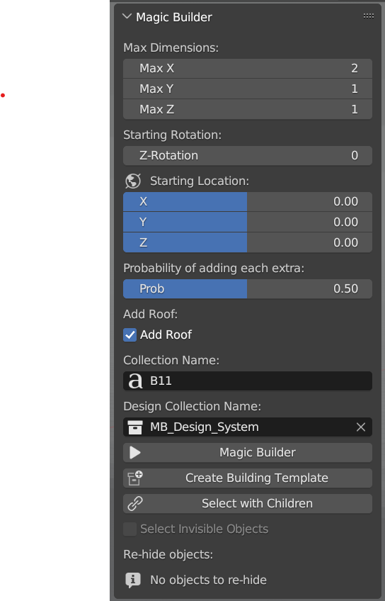
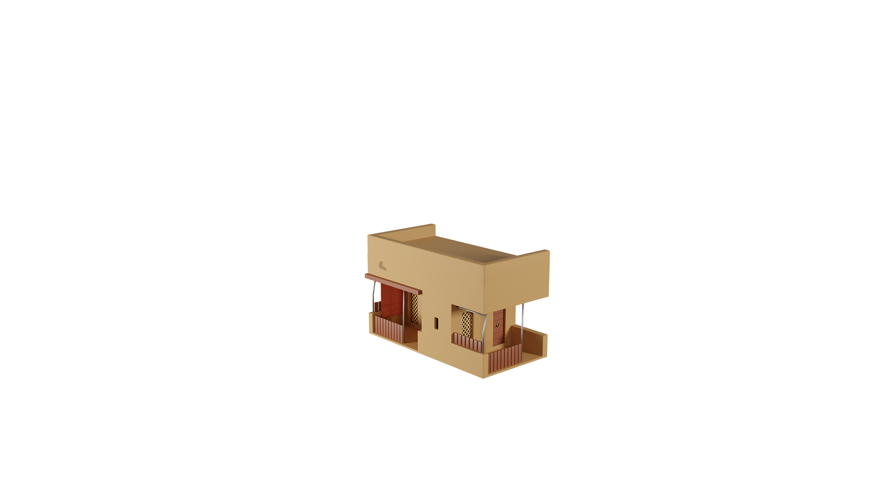

# MagicBuilder

 </img></a>

MagicBuilder is a blender add-on that implements a custom procedural building generation

<!-- Center images -->

    
    

Above is a sample building generated with the add-on. I am not the best at modeling, so the building is not perfect :) I will soon add a better model that showcases the add-on's capabilities better.

# Road Map
- [ ] Add a better model
    - [ ] Showcase randomized object placement for props
    - [ ] Showcase randomized object placement for extras
    - [ ] Showcase multi-floor variations
- [ ] Add a better documentation
    - [ ] Add a tutorial
    - [ ] Add a wiki
- [ ] Functionality Improvements
    - [x] Random extra population
    - [x] Random prop population
    - [x] Optional rooftop
    - [x] Custom starting location
    - [x] Custom z rotation
    - [x] Probability picker for extras
    - [x] Auto Template Generation
    - [x] Custom prop sizing
    - [x] Children selection button (for moving the objects with children)
        - [x] Option to include invisible objects in the selection
        - [x] Option to bulk re-hide the invisible objects
    - [ ] Make the extra probs optionally manual (name based)
    - [ ] Add extra logic for narrow buildings, add another type (square) besides edge, corner and center.
    - [ ] Add material support 

# Model Notes
- The model props do not support targeted mirror modifier. Please apply the mirror modifier before generating the model. (Except self-mirror)
- Make sure the props' origin is always in the center of the model (This doesn't always mean "move origin to geometry" if the model size is 2x2x2 it should be at 1,1,1 etc.)
- The extras must have the same origin point as the prop.
- Initial version implemented allowed boolean modifier, but it was removed due to performance issues. If you have a boolean on an object you have to apply it before generating the model.