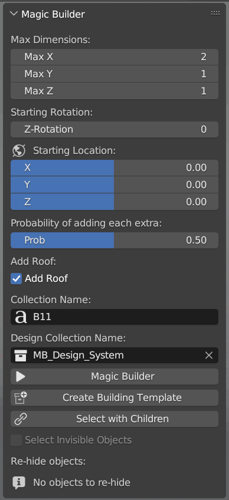

# Blender-MagicHouse
MagicHouse is a blender add-on that implements a custom procedural building generation

<!-- Adding the images side by side -->

    
    

# Model Notes
- The model props do not support targeted mirror modifier. Please apply the mirror modifier before generating the model. (Except self-mirror)
- Make sure the props' origin is always in the center of the model (This doesn't always mean "move origin to geometry" if the model size is 2x2x2 it should be at 1,1,1 etc.)
- The extras must have the same origin point as the prop.